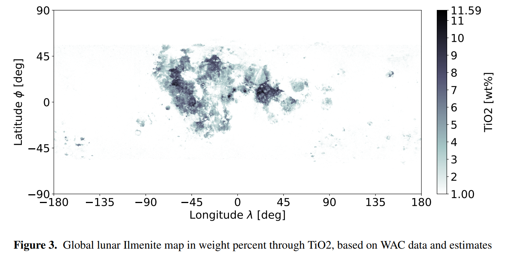
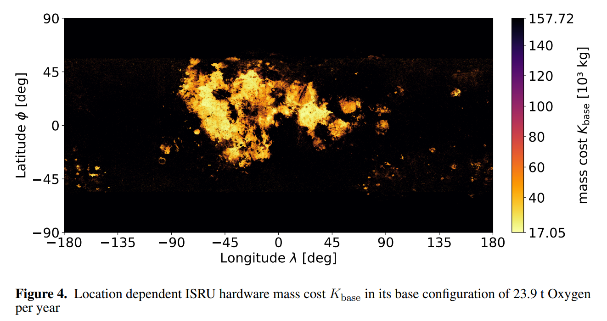
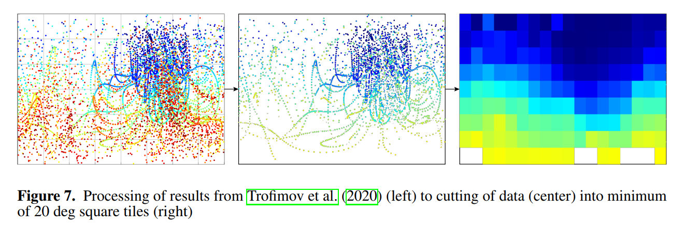
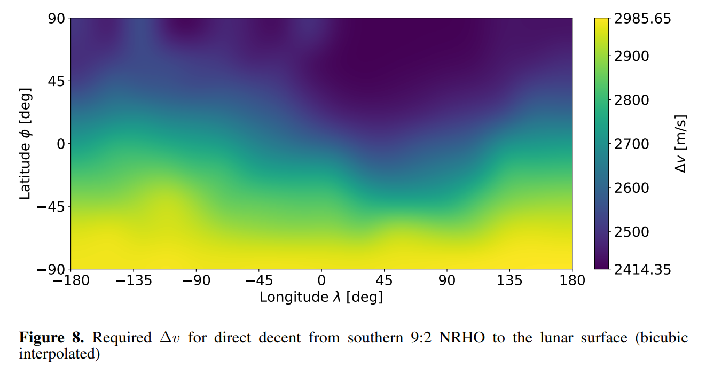
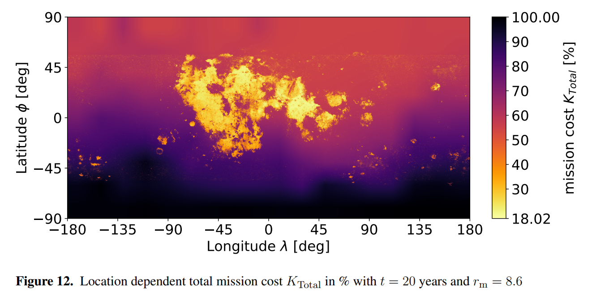
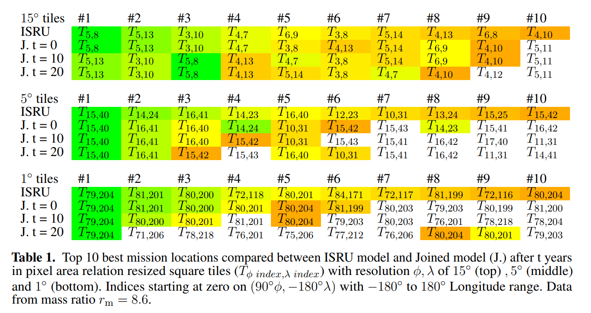

# Location dependent flight cost differences from the lunar surface to an orbital fuel depot and its influence on ISRU location selection

**Frontiers in Space Technologies**
<br>
Space Exploration Volume 5 - 2024
<br>
doi: [10.3389/frspt.2024.1352213](https://doi.org/10.3389/frspt.2024.1352213)

*Sven Julius Steinert, Paul Zabel, Dominik Quantius*

| [](https://raw.githubusercontent.com/Sven-J-Steinert/10.3389-frspt.2024.1352213/master/manuscript.pdf?raw=true)  | [Download the full .PDF](https://raw.githubusercontent.com/Sven-J-Steinert/10.3389-frspt.2024.1352213/master/manuscript.pdf?raw=true)  | 
| -------- | ------- |

## Abstract
With increasing relevance for lunar activities, the location selection for in situ resource utilization (ISRU) facilities is a necessary step to identify the most suitable configuration during mission planning. To raise information about the dominant location dependencies, a scenario was set up where an ISRU product is exported to an orbital depot and mass costs are used for classification.In the selected scenario, Oxygen is produced by an Ilmenite reduction plant and subsequently exported to the Lunar Gateway via an Oxygen-Hydrogen fueled launcher running in a round-trip, refueling Oxygen at the lunar surface and Hydrogen at the Lunar Gateway. It showed that the variations in transport costs can be either entirely avoided or have a recessive influence on the mission's total costs over an extended amount of time, such as 20 years. The identification of the top 10 most optimal locations for various resolutions were only slightly altered under consideration of flight costs compared to only considering the ISRU factors, which concludes the insignificance of flight cost dependencies for the analysed case.

## Created Resources
|  Resource  (Lat. -180..180)  |  Unit | Resolution | Format | Value Divider |
| -------- | :---: |  :---: | -------- | :---: |
| WAC_TIO2_COMBINED |  wt%  |27360 x 10640     | [.png](https://github.com/Sven-J-Steinert/10.3389-frspt.2024.1352213/blob/master/maps/preparation/TiO2/WAC_TIO2_COMBINED.png?raw=True) | 22 |
| WAC_TIO2_GLOBAL |   wt%  | 27360 x 13680     | [.png](https://github.com/Sven-J-Steinert/10.3389-frspt.2024.1352213/blob/master/maps/WAC_TIO2_GLOBAL.png?raw=True) | 22 | 
| dv_map_NRHO    |  m/s  | 18 x 9    | [.nc](https://github.com/Sven-J-Steinert/10.3389-frspt.2024.1352213/blob/master/maps/dv_map_NRHO.nc?raw=True) | |  |
| ISRU_COST_GLOBAL  |  kg  | 27360 x 13680    | [.png](https://github.com/Sven-J-Steinert/10.3389-frspt.2024.1352213/blob/master/maps/ISRU_COST_GLOBAL.png?raw=True) | 2.4066300450141145  |
| spent_fuel_NRHO_1_5  |  kg/kg  | 18 x 9    | [.nc](https://github.com/Sven-J-Steinert/10.3389-frspt.2024.1352213/blob/master/maps/spent_fuel_NRHO_1_5.nc?raw=True) | |  |
| spent_fuel_NRHO_2_0  |  kg/kg  | 18 x 9    | [.nc](https://github.com/Sven-J-Steinert/10.3389-frspt.2024.1352213/blob/master/maps/spent_fuel_NRHO_2_0.nc?raw=True) | |  |

### Load Bitmap (.png)
```
from PIL import Image
Image.MAX_IMAGE_PIXELS = 1000000000
data = np.array(Image.open("maps/WAC_TIO2_GLOBAL.png")) / devider
```

### Load X-Array (.nc)
```
import xarray as xr
xA = xr.open_dataarray("maps/dv_map_NRHO.nc") # xArray with metadata
data = xA.data
```

## TL;DR Runthrough


A global Ilmenite map was created.



Mass costs for an ISRU Oxygen factory are computed.



Delta v requirements from the lunar surface to the orbital fuel depot are derived from a previous work.



A global delta v map was derived.



The combined cost map was established, showing the results over mission duration.



The two influences, ISRU and transport are compared on their relevance for location selection.



Transport costs have a marginal influence in the location selection in this case.

<meta name="google-site-verification" content="JJSLVVHRTa3-_HkAaNoBEYtCm7RiAjuba9XKOUl-aWQ" />
